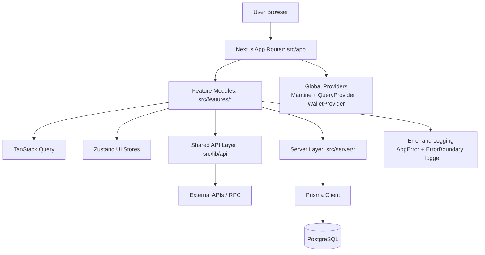

# DeFi Portfolio Dashboard Architecture

## 1. Overview

This document describes:

- The overall architecture of the web application
- The development process used to deliver features safely and consistently

The project is a Next.js App Router application with a feature-first frontend structure, typed contracts, centralized API utilities, and layered server-side modules.

## 2. Architectural Goals

- Keep domain logic close to each feature for maintainability
- Separate UI state from server state
- Enforce type-safe boundaries for API and environment configuration
- Make failures observable and recoverable
- Enable fast iteration with reliable test and lint gates

## 3. High-Level System Context

The web app serves DeFi dashboard experiences including:

- Portfolio views and snapshots
- Market and trading views
- Wallet connection and wallet-centric workflows

Primary integrations:

- EVM/Web3 access via wagmi, RainbowKit, and viem
- Server and third-party APIs through shared HTTP utilities
- PostgreSQL persistence through Prisma (for snapshots, transactions, watchlist, and user-wallet relations)

## 4. Layered Application Architecture

### 4.1 Layer Summary

1. Presentation Layer
   - Next.js routes in src/app
   - Reusable UI primitives in src/components/ui
   - Shared layout elements in src/components/shared/layout

2. Feature Layer
   - Domain modules in src/features (portfolio, market, trading, wallet, dashboard)
   - Per-feature components, hooks, schemas, services, types, and tests

3. Application Core Layer
   - Cross-cutting modules in src/lib:
     - API client/error normalization
     - Query client/provider
     - Logging and error boundaries
     - Config and environment validation
     - constants/routes
     - DB client wrappers

4. State and Caching Layer
   - TanStack Query for server state (remote data caching and request lifecycle)
   - Zustand stores in src/stores for local UI state (sidebar, currency, watchlist, chart range)

5. Server and Persistence Layer
   - Server-side service/repository/use-case modules in src/server
   - Prisma models in prisma/schema.prisma backed by PostgreSQL

### 4.2 Directory Responsibility Model

- src/app: Routing, layout composition, and page entry points
- src/features: Domain implementation by business capability
- src/lib: Shared framework services and platform utilities
- src/server: Backend-oriented orchestration and data access boundaries
- src/stores: Lightweight client-side state stores
- src/locales: Translation dictionaries
- src/test and src/tests: Test setup and component-level tests

### 4.3 Runtime Composition

Root composition in app/layout.tsx wires core providers:

- MantineProvider for theme/design system
- QueryProvider for React Query cache context
- WalletProvider for wallet integration context

This creates a stable app shell before feature routes render.

### 4.4 Data Flow Pattern

Feature-level data flow follows a consistent pattern:

1. Route/page invokes feature component
2. Feature hook/service requests data through shared API utilities
3. Shared HttpClient/fetch layer executes request and normalizes errors
4. TanStack Query caches successful responses and manages retries/staleness
5. UI renders loading/success/error states
6. Errors are captured by local handling and global error boundaries/loggers

### 4.5 Error Handling and Observability

- AppError is used as a normalized error shape for API failures
- toAppError converts unknown throwables into a predictable application error
- ErrorBoundary captures rendering failures and triggers client logging
- Logger modules separate client, server, and route-level reporting concerns

### 4.6 Type Safety and Validation

- TypeScript strict mode is enabled
- Path aliasing uses @/_ => src/_ for clean imports
- Environment configuration is centralized and validated in src/lib/config/env.ts
- Feature-local schemas and shared type modules enforce API and domain contracts

### 4.7 Performance and UX Strategy

- React Query defaults reduce unnecessary refetching and noisy cache churn
- Feature modules encourage selective memoization and lazy loading where justified
- Dashboard composition supports incremental feature growth without monolithic pages

## 5. Architecture Diagram

## 6. Development Process

### 6.1 Process Objectives

- Deliver features quickly without reducing reliability
- Keep changes small, testable, and reviewable
- Catch issues early through automated checks

### 6.2 Standard Workflow

1. Plan
   - Clarify the user story and acceptance criteria
   - Identify impacted feature module(s), shared lib modules, and tests

2. Design
   - Decide boundaries first: route, feature, shared lib, server
   - Prefer adding logic inside the closest feature module before promoting to shared code

3. Implement
   - Build/adjust page or component entry points in src/app and src/features
   - Add or update schemas/types close to the feature
   - Use shared HTTP/query/error infrastructure instead of duplicating logic

4. Validate Locally
   - Type checking: npm run typecheck
   - Linting: npm run lint
   - Unit tests: npm run test:unit
   - E2E tests for user-critical flows: npm run test:e2e

5. Pre-Commit Quality Gate
   - Husky + lint-staged run format/lint on staged files
   - Expected outcome: clean formatting, no lint errors introduced

6. Review and Merge
   - Open PR from feature branch to main integration line
   - Address code review findings (correctness, risk, maintainability, tests)
   - Merge after checks pass

### 6.3 Definition of Done (Per Change)

- The feature behavior matches acceptance criteria
- No TypeScript or lint regressions
- Existing tests pass; new tests added where behavior changed
- Error and loading states are handled for async flows
- Architecture boundaries are respected (no cross-layer leakage)

### 6.4 Testing Strategy

- Unit/component tests (Vitest + Testing Library)
  - Focus on feature logic, rendering behavior, and edge cases

- End-to-end tests (Playwright)
  - Focus on route transitions, key user journeys, and integration behavior
  - Multi-browser projects include Chromium and Firefox

Recommended test pyramid:

- More unit/component coverage for deterministic logic
- Smaller set of high-value E2E scenarios for cross-layer confidence

### 6.5 Environment and Configuration Process

1. Define required environment variables in a single typed module
2. Fail fast on missing required values at startup
3. Keep secrets out of source and CI logs
4. Use feature flags for incremental rollout of risky functionality

### 6.6 Release Readiness Checklist

- Build succeeds (npm run build)
- Critical E2E flows pass in CI mode
- No unresolved high-severity review comments
- Database-impacting changes are reflected in Prisma workflow

## 7. Practical Conventions for This Repository

- Prefer feature-local ownership first, shared abstractions second
- Use src/lib only for true cross-feature concerns
- Keep UI state in Zustand and remote state in React Query
- Keep API error normalization centralized
- Keep architecture docs updated when introducing new cross-cutting patterns

## 8. Future Evolution Paths

- Add explicit API contract tests between frontend and server modules
- Introduce trace/correlation IDs across client-server logs
- Expand feature-level ADR notes for major design decisions
- Formalize release versioning and deployment promotion stages
